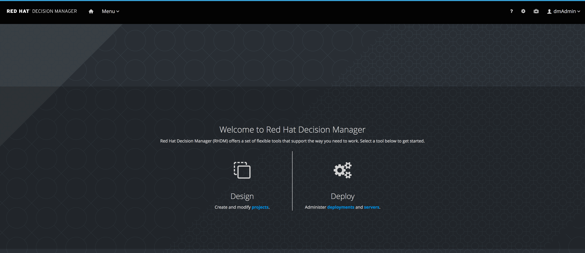

Red Hat Decision Manager 7 Install Demo
=======================================
Project to automate the installation of this product without preconfiguration beyond a single admin user.

There are three options available to you for using this demo: local, OpenShift and Docker.

Software
--------
The following software is required to run this demo:
- [JBoss EAP 7.1 zip archive](https://developers.redhat.com/download-manager/file/jboss-eap-7.1.0.zip)
- [Red Hat Decision Manager: Decision Central 7.0.0.GA deployable for EE7](https://developers.redhat.com/download-manager/file/rhdm-7.0.0.GA-decision-central-eap7-deployable.zip)
- [Red Hat Decision Manager: KIE-Server 7.0.0.GA deployable for EE7](https://developers.redhat.com/download-manager/file/rhdm-7.0.0.GA-kie-server-ee7.zip)
- [7-Zip](http://www.7-zip.org/download.html) (Windows only): to overcome the Windows 260 character path length limit, we need 7-Zip to unzip the Decision Manager deployable.

Option 1 - Install on your machine
----------------------------------
1. [Download and unzip](https://github.com/jbossdemocentral/rhdm7-install-demo/archive/master.zip) or [clone this repo](https://github.com/jbossdemocentral/rhdm7-install-demo.git).

2. Add the EAP zip archive and Decision Manager deployables to the installs directory.

3. Run `init.sh` (Linux/macOS) or `init.ps1` (Windows) file.

4. Start the runtime: `./target/jboss-eap-7.1/bin/standalone.sh'` (Linux/macOS) or `.\target\jboss-eap-7.1\bin\standalone.ps1` (Windows)

5. Login to Decision Central at: http://localhost:8080/decision-central  (u:dmAdmin / p:redhatdm1!)

6. Enjoy the installed and configured Red Hat Decision Manager 7.

Option 2 - Run on OpenShift
-----------------------------------------
This demo can be installed on Red Hat OpenShift in various ways. We'll explain the different options provided.

All installation options require an `oc` client installation that is connected to a running OpenShift instance. More information on OpenShift and how to setup a local OpenShift development environment based on the Red Hat Container Development Kit can be found [here](https://developers.redhat.com/products/cdk/overview/).

---
**NOTE**

The Red Hat Decision Manager 7 - Decision Central image requires a [Persistent Volume](https://docs.openshift.com/container-platform/3.7/architecture/additional_concepts/storage.html) which has both `ReadWriteOnce` (RWO) *and* `ReadWriteMany` (RWX) Access Types. If no PVs matching this description are available, deployment of that image will fail until a PV of that type is available.

---

### Automated installation
This installation option will install the Decision Manager 7 and Decision Service in OpenShift using a single script, after which the demo project needs to be manually imported.

1. [Download and unzip](https://github.com/jbossdemocentral/rhdm7-install-demo/archive/master.zip) or [clone this repo](https://github.com/jbossdemocentral/rhdm7-install-demo.git).

2. Run the "init-openshift.sh" file (for Linux and macOS, Windows support will be added in the near future). This will create a new project and application in OpenShift.

3. Login to your OpenShift console. For a local OpenShift installation this is usually: https://{host}:8443/console

4. Open the project "RHDM7 Install Demo". Open the "Overview" screen. Wait until the 2 pods, "rhdm7-loan-rhdmcentr" and "rhdm7-loan-kieserver" have been deployed.

5. Open the "Applications -> Routes" screen. Click on the "Hostname" value next to "rhdm7-loan-rhdmcentr". This opens the Decision Central console.

6. Login to Decision Central (u:dmAdmin, p:redhatdm1!)

7. Enjoy the installed and configured Red Hat Decision Manager 7.

### Scripted installation
This installation option will install the Decision Manager 7 and Decision Service in OpenShift using a the provided `provision.sh` script, which gives
the user a bit more control how to provision to OpenShift.

1. [Download and unzip.](https://github.com/jbossdemocentral/rhdm7-install-demo/archive/master.zip) or [clone this repo](https://github.com/jbossdemocentral/rhdm7-install-demo.git).

2. In the demo directory, go to `./support/openshift`. In that directory you will find a `provision.sh` script. (Windows support will be introduced at a later time).

3. Run `./provision.sh -h` to inspect the installation options.

4. To provision the demo, with the OpenShift ImageStreams in the project's namespace, run `./provision.sh setup rhdm7-loan --with-imagestreams true`.

    ---
    **NOTE**

    The `--with-imagestreams true` parameter installs the Decision Manager 7 image streams and templates into the project namespace instead of the `openshift` namespace (for which you need admin rights). If you already have the required image-streams and templates installed in your OpenShift environment in the `openshift` namespace, you can omit the `--with-imagestreams true` from the setup command.

    ---

6. After provisioning, follow the instructions from above "Option 2 - Automated installation, manual project import", starting at step 3.

7. To delete an already provisioned demo, run `./provision.sh delete rhdm7-loan`.

Option 3 - Run in Docker
-----------------------------------------
The following steps can be used to configure and run the demo in a container

1. [Download and unzip](https://github.com/jbossdemocentral/rhdm7-install-demo/archive/master.zip) or [clone this repo](https://github.com/jbossdemocentral/rhdm7-install-demo.git).

2. Add the EAP zip archive and Decision Manager deployables to the installs directory.

3. Run the 'init-docker.sh' (Linux/macOS) or 'init-docker.ps1' (Windows) file.

4. Start the container: `docker run -it -p 8080:8080 -p 9990:9990 jbossdemocentral/rhdm7-install-demo`

5. Login to Decision Central at: http://&lt;CONTAINER_HOST&gt;:8080/decision-central  (u:dmAdmin / p:redhatdm1!)

7. Enjoy the installed and configured Red Hat Decision Manager 7.

Supporting Articles
-------------------
- [Getting Started with Red Hat Decision Manager 7](https://upload.wikimedia.org/wikipedia/commons/6/67/Learning_Curve_--_Coming_Soon_Placeholder.png)

Released versions
-----------------
See the tagged releases for the following versions of the product:

- v1.0 - Red Hat Decision Manager 7.0.0.GA

